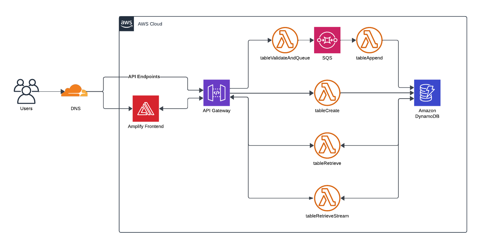

# Webhook Table

[](https://app.getpostman.com/run-collection/15715400-f2e331ac-3dc7-410f-88cd-dceb4525d21c?action=collection%2Ffork&source=rip_markdown&collection-url=entityId%3D15715400-f2e331ac-3dc7-410f-88cd-dceb4525d21c%26entityType%3Dcollection%26workspaceId%3D882bbe8c-d0d2-4cdd-b2c2-0d95ce90c607)

Webhook Table is a reliable, serverless solution designed for effortless data storage via webhooks. This system enables seamless data population in tables through simple webhook calls, paired with a user-friendly interface for data visualization.

## Why Webhook Table?

In my recent projects, I’ve leaned towards serverless architectures for their scalability and cost-efficiency. However, the need to set up and maintain a database often complicates deployment. Webhook Table addresses this by providing a simple, serverless way to store and retrieve data without the overhead of managing a traditional database. While it’s not a full-fledged database replacement, it’s ideal for use cases like storing form submissions or capturing webhook data without setting up a dedicated database.

## Getting Started

1. Visit [table.dcastillogi.com](https://table.dcastillogi.com/) website.
2. Create a new table by providing a `tableId` and a `password`.
3. Send data to the table using the `tableId` by making a GET or POST request to `https://api.table.dcastillogi.com/append/{tableId}`. You can include your data as a JSON object in the request body or as query parameters. . For example, using `curl` with query parameters:

   ```bash
   curl -G "https://api.table.dcastillogi.com/append/table1" --data-urlencode "column1=value1" --data-urlencode "column2=value2"
    ```

4. Access your data on [table.dcastillogi.com](https://table.dcastillogi.com/) with your `tableId` and `password`.

## Key Features

- Default encryption: Uses Zero-Access policies with OpenPGP.
- Quick setup: Create your credentials and start using inmediatly.
- Open source: Review the code to address any security concerns.
- Easy to use: Send data with a simple webhook call.

## Architecture

The system architecture is illustrated in the following diagram:

[](./architecture.png)

## Frontend

The frontend is developed using Next.js and React, leveraging both Static Site Generation (SSG) and Client-Side Rendering (CSR) for optimal performance and flexibility. This approach provides an intuitive interface for creating tables, sending data, and retrieving information. The application is hosted on AWS Amplify, ensuring seamless deployment and scalability.

## Database

Webhook Table leverages *DynamoDB*, a NoSQL database service, for flexible and scalable data storage. Below is an example of a user’s table (item/record/document):

```json
{
  "tableId": "........",
  "keys": {
    "publicKey": "........",
    "privateKey": "........"
  },
  "rows": [
    {
      "column1": "value1",
      "column2": "value2"
    },
    ...
  ],
  "columns": ["column1", "column2", "column3"]
}
```

All data is encrypted with the table’s public key. The private key is securely stored, armored with the user’s password. Data is decrypted during retrieval, ensuring that your password never resides in the database.

## Lambda Functions

### hookTableValidateAndQueue

- **Function**: Validates incoming data before inserting in table and queue it in SQS.
- **Parameters**: `tableId`, row columns and values
- **Process**:
  1. Validate the incoming data for correctness and completeness.
  2. If the data is valid, queue it in SQS for further processing.
  3. Return a success message to the user.
- **Note**: While data insertion is highly likely to proceed without issues, final validation and insertion are handled by [hookTableAppend](#hooktableappend) after the queue.

### hookTableAppend

- **Function**: Adds new rows to the table.
- **Parameters**: `tableId`, row columns and values
- **Process**:
  1. Retrieve and verify the table’s existence.
  2. Identify and incorporate any new columns into the table schema.
  3. Encrypt the new row with the public key and add it to the table.

### hookTableRetrieve

- **Function**: Retrieves data from the user's table.
- **Parameters**: `publicKey`, `privateKey`, `tableId`, `hCaptchaToken`
- **Process**:
  1. Unarmor the private key using the user-provided password.
  2. Validate the decryption of the private key.
  3. If valid, return the decrypted table data to the user.

### hookTableRetrieveStream

- **Function**: Streams table data as an alternative to `hookTableRetrieve` which sends data until all payload is complete. This aproach alows users to start viewing the data already decrypted. As decryption progresses, additional data is sent to the user, providing a continuous and useful data viewing experience.
- **Parameters**: `publicKey`, `privateKey`, `tableId`, `hCaptchaToken`
- **Process**:
  1. Unarmor the private key using the user-provided password.
  2. Validate the decryption of the private key.
  3. If valid, streams the decrypted table row by row.
- **Note**: AWS weird Lambda’s streaming behavior can cause delays in data delivery. AWS may only stream data once a large chunk is completed rather than sending individual rows in real-time. For more details on this behavior, refer to [Forcing Lambda Response Streaming to Flush Content](https://betterdev.blog/lambda-response-streaming-flush-content/).

### hookTableCreate

- **Function**: Creates a new user's table.
- **Parameters**: `password`, `tableId`, `hCaptchaToken`
- **Process**:
  1. Generates a new pair of public and private keys based on `password`.
  2. Creates a new table with `tableId`.
  3. Stores the public key.

## Security

- **End-to-End Encryption:** Data is encrypted using OpenPGP standards, ensuring that only users with the correct password can access it.
- **Password Protection:** Your password is never stored in the database. It is only used temporarily during the decryption process and is received from the client each time it is needed.
- **Zero-Access policies:** Not even system administrators can access unencrypted table's records.

## Contributions

Contributions are welcome. Please open an issue or a pull request for suggestions or improvements.

## Disclaimer

This project operates on the free tier of AWS. As such, your data may be erased without prior notice, and the service may become unavailable. Data integrity or security are NOT guaranteed.

Please be aware that, at this stage, anyone with access to your `tableId` can insert data into your table. Additionally, using a weak password can compromise your data. The primary security measure is encryption with your password, so it is crucial to use a strong and secure password.

Be mindful that brute-force attacks could potentially access your data. This project does not have privacy policies or data management practices in place, and we are not responsible for the data you store in these tables. This solution is not intended for sensitive information.

## License

This project is licensed under GNU General Public License v3.0. See the `LICENSE` file for more details.
